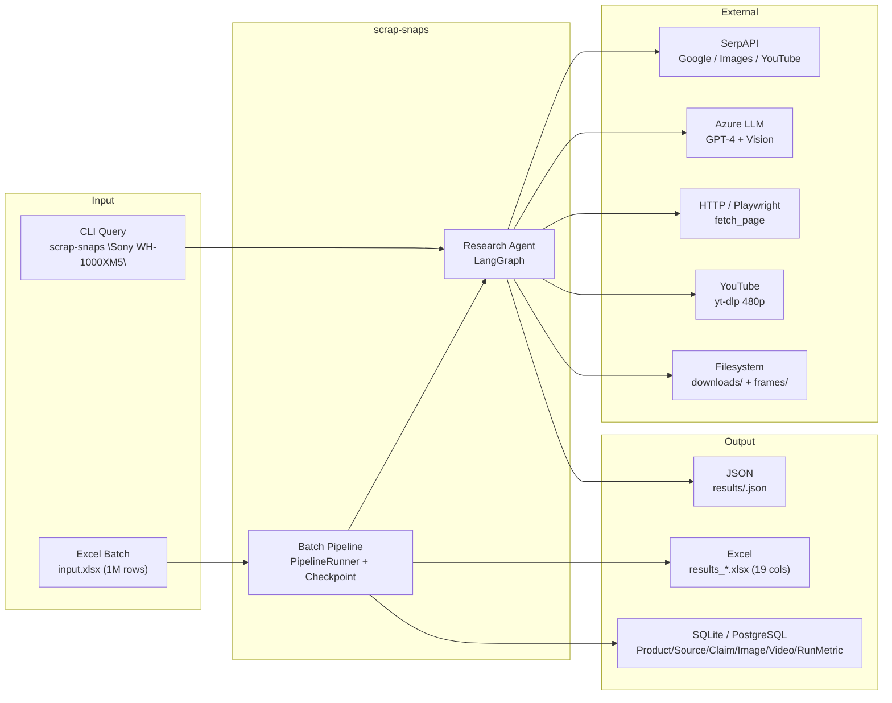
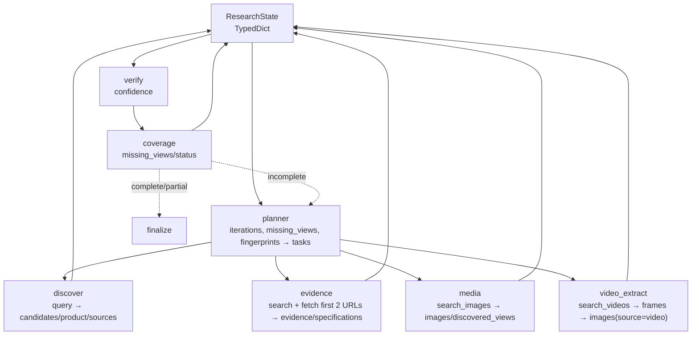
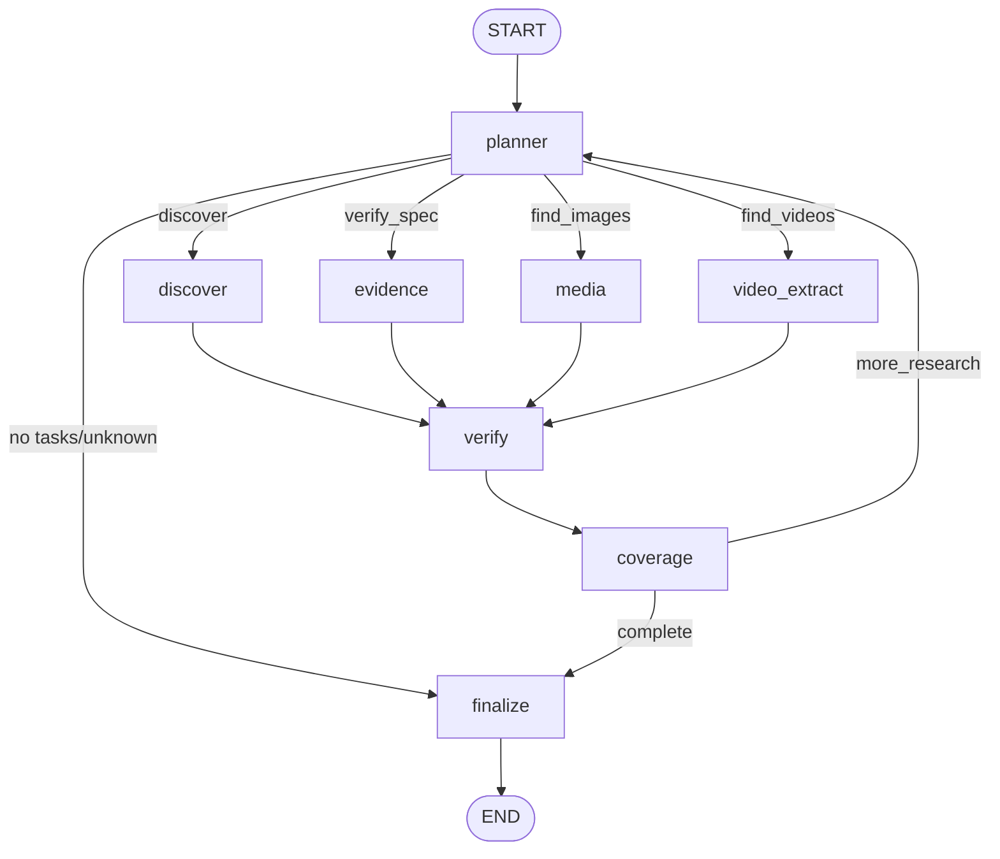

# Developer Guide — scrap_snaps

> Autonomous Product Research Agent built with **LangGraph**, **Azure LLM (GPT-4 Vision)**, **SerpAPI**, **SQLAlchemy**, and **openpyxl**. This guide is the single source for architecture, workflow, extension, and troubleshooting.

**Audience:** Contributors, reviewers, and operators who need to understand, extend, or debug the system end-to-end.

**Last updated:** 2026-08-20 — covers `f81d846` + `0332799` hardening.

---

## Table of Contents

- [1. Mental Model (5-min overview)](#1-mental-model-5-min-overview)
- [2. Architecture](#2-architecture)
- [3. Project Structure](#3-project-structure)
- [4. Core Concepts](#4-core-concepts)
- [5. Agents Deep Dive](#5-agents-deep-dive)
- [6. Nodes (Thin Wrappers)](#6-nodes-thin-wrappers)
- [7. Tools Catalog](#7-tools-catalog)
- [8. Pipeline (Batch Excel)](#8-pipeline-batch-excel)
- [9. Database Models](#9-database-models)
- [10. Configuration System](#10-configuration-system)
- [11. Development Setup](#11-development-setup)
- [12. Development Workflow](#12-development-workflow)
- [13. Extending the System](#13-extending-the-system)
- [14. Debugging & Troubleshooting](#14-debugging--troubleshooting)
- [15. Performance & Cost](#15-performance--cost)
- [16. Security Hardening (what we fixed)](#16-security-hardening-what-we-fixed)
- [17. API / CLI Reference](#17-api--cli-reference)
- [18. Release & Contributing](#18-release--contributing)

---

## 1. Mental Model (5-min overview)

```
Query / Excel row → create_initial_state() → LangGraph stream
  planner (LLM → Task[]) → router → {discover|evidence|media|video_extract}
  → verify (scoring) → coverage (gap + termination) → loop or finalize
  → extract_result → Excel + SQLite/PostgreSQL + JSON
```

* **Single source of truth:** `ResearchState` TypedDict (`src/state.py`). Every node reads/writes this dict; LangGraph merges via `dict.update` (no `Annotated` reducers).
* **Autonomy:** Planner is LLM-driven with deterministic fallback; coverage enforces termination even if LLM loops.
* **Isolation:** Per-row `SearchCache.clear()` + `FailedURLTracker.clear()` + `PHashCache.clear()` + `UsageTracker.reset()` — no cross-product leakage.
* **Failure is data:** `partial_complete` is a valid terminal status (missing views/specs preserved), not an exception.

---

## 2. Architecture

### 2.1 System Context



### 2.2 Data Flow (what each node reads/writes)



### 2.3 Graph Topology



**Termination (any suffices):**
1. `coverage` → `complete` (all required views/specs met)
2. `coverage` → `partial_complete` (hard cycles ≥10, no-progress, proximity `iterations ≥ max*0.8`)
3. `planner` fingerprint dup ≥2 cycles → `partial_complete`
4. `planner` `iterations > max_iterations` → `max_iterations_reached`
5. `finalize` preserves terminal status (`partial_complete`, `max_iterations_reached`, `complete`, `failed`) else `done`

---

## 3. Project Structure

```
scrap_snaps/
├── config.yaml                 # Single source for non-credential settings (157 lines, all commented)
├── .env.example                # Credentials template (AZURE_*, SERPAPI_KEY, DATABASE_URL)
├── pyproject.toml              # hatchling build, deps, ruff, pytest
├── uv.lock
├── src/
│   ├── main.py                 # CLI single-query, stream+update, fallback JSON+DB
│   ├── state.py                # ResearchState TypedDict + create_initial_state()
│   ├── graph.py                # Re-export core.graph for compat
│   ├── llm.py                  # Corporate Azure gateway (headers x_niq_cis_consumer, apikey=nokey)
│   ├── config/
│   │   ├── settings.py         # Pydantic Settings + @model_validator overlay YAML+env
│   │   ├── yaml_loader.py      # _YAML_TO_SETTINGS, safe_load, get_pipeline_config()
│   │   ├── logging.py          # structlog, redact, file+console
│   │   └── __init__.py         # Re-exports flat constants (MAX_ITERATIONS, REQUIRED_VIEWS…)
│   ├── core/
│   │   ├── graph.py            # build_graph(), finalize(), route_after_planner()
│   │   └── registry.py         # Plugin registry (nodes/tools/agents/graphs)
│   ├── agents/
│   │   ├── base.py             # BaseAgent (get_llm, remove_tasks_by_type)
│   │   ├── planner.py          # PlannerAgent + fallback matrix (7 modes)
│   │   ├── researcher.py       # ResearchAgent.discover / extract_evidence
│   │   ├── media_collector.py  # MediaAgent.collect_images / collect_videos / _collect_video_urls
│   │   ├── verifier.py         # VerifierAgent (weighted confidence)
│   │   └── coverage.py         # CoverageAgent.analyze + route (view norm, proximity)
│   ├── nodes/
│   │   ├── planner.py, discovery.py, evidence.py, media.py, video_extract.py, verification.py, coverage.py
│   │   └── __init__.py
│   ├── tools/
│   │   ├── logging.py          # @log_tool_call decorator (truncates, level DEBUG)
│   │   ├── usage.py            # UsageTracker singleton (tokens, llm_calls, elapsed, lock)
│   │   ├── web/
│   │   │   ├── search.py       # search_web/images/videos via SerpAPI + SearchCache
│   │   │   ├── cache.py        # SearchCache (key=engine+norm_query+num, FIFO 500, budget 20/row)
│   │   │   ├── fetch.py        # fetch_page / fetch_page_js (Playwright) / extract_structured_data
│   │   │   └── robots.py       # can_fetch via RobotFileParser
│   │   ├── media/
│   │   │   ├── images.py       # download_image, analyze_image/batch (Vision), deduplicate_images
│   │   │   └── video.py        # download_video (yt-dlp), extract_frames (scenedetect+cv2), select_best_frames
│   │   ├── db/
│   │   │   └── evidence.py     # save_evidence (ORM)
│   │   └── utils/
│   │       ├── http.py         # http_get, can_fetch, rate_limit, Failed URL-aware
│   │       ├── hashing.py      # perceptual_hash, PHashCache, are_hashes_similar
│   │       └── failed_urls.py  # FailedURLTracker (time.time TTL 300s, atomic JSON persist)
│   ├── io/
│   │   ├── excel_reader.py     # Streaming read_only, try/finally close, header dedup
│   │   ├── excel_writer.py     # Atomic .tmp→replace, formula sanitize, numeric preserve
│   │   ├── naming.py           # make_filename/path (slug, hash10, traversal guard)
│   │   └── storage.py          # LocalStorage (resolve guard), Azure placeholder, get_storage()
│   ├── pipeline/
│   │   ├── runner.py           # PipelineRunner (batch, per-row isolation, DB session, checkpoint)
│   │   ├── checkpoint.py       # CheckpointData/Manager (md5 path, is_processed both lists)
│   │   ├── results.py          # extract_result / extract_result_for_row + _extract_error
│   │   └── cli.py              # argparse → PipelineConfig → Runner
│   ├── db/
│   │   ├── __init__.py         # Base, Product/Source/Claim/Image/Video/RunMetric, get_engine/session
│   │   └── utils.py            # save_result_to_db, save_run_metrics
│   └── search/
│       ├── focus.py            # FocusArea enum, FocusConfig (modifiers/domains)
│       ├── query_builder.py    # build_queries(task, focus, limit)
│       └── filters.py          # score_source, domain filter
├── tests/
│   └── test_state.py           # ResearchState + create_initial_state invariants
└── docs/
    └── DEVELOPER_GUIDE.md      # ← you are here
```

---

## 4. Core Concepts

### 4.1 ResearchState (`src/state.py`)

Single `TypedDict(total=False)` flowing through LangGraph. No `Annotated` reducers → **replace semantics** via `dict.update`. Agents must **copy** before mutating:

```python
# correct
evidence_list = list(state.get("evidence", []))
specs = dict(state.get("specifications", {}))
discovered = {k: list(v) for k, v in state.get("discovered_views", {}).items()}

# wrong — mutates upstream snapshot
evidence_list = state.get("evidence", [])
evidence_list.append(new)  # leaks to checkpoint replay
```

**Key fields (29):**

| Group | Fields |
|-------|--------|
| Request | `query`, `__row_index`, `focus_areas`, `focus_config`, `collect_specs`, `collect_media: str|None` |
| Identity | `product: dict`, `candidates: list` |
| Discovery | `search_queries`, `searched_queries`, `sources` |
| Evidence | `evidence`, `specifications` |
| Media | `images`, `videos`, `video_frames`, `required_views`, `discovered_views`, `missing_views` |
| Control | `tasks`, `completed_tasks`, `failed_tasks`, `failed_media_urls`, `previous_task_fingerprints`, `_coverage_cycles`, `_prev_*`, `iterations`, `max_iterations`, `serpapi_budget_remaining` |
| Final | `confidence`, `status: started|done|complete|partial_complete|max_iterations_reached|failed`, `error` |

`create_initial_state()` seeds `REQUIRED_VIEWS` (7 defaults: `front,back,left,right,top,360_strip,multi_angle_composite`), `status="started"`, `serpapi_budget_remaining=SERPAPI_MAX_HITS_PER_ROW`, `__row_index=0`, `error=""`, then `state.update(kwargs)` for caller overrides.

### 4.2 Graph & Registry (`src/core/graph.py`, `registry.py`)

* `build_graph(use_registry=True)` registers `PlannerAgent/ResearchAgent/MediaAgent/VerifierAgent/CoverageAgent` via `registry._nodes` then `StateGraph(ResearchState)` with 8 nodes + 2 conditionals.
* `route_after_planner` on `tasks[0].type`; unknown → `finalize` with warning.
* `finalize` now preserves `complete/partial_complete/max_iterations_reached/failed` (fix from silent `complete→done` overwrite).
* `registry` is singleton; `register_default_components()` idempotent. Useful for testing `build_graph(use_registry=False)`.

### 4.3 Stream vs Invoke

`main.py` / `runner.py` use `graph.stream` for per-node logging but **merge** correctly:
```python
final_state = dict(initial_state)
for event in graph.stream(initial_state, {"recursion_limit": safe}):
    for key, value in event.items():
        if value:
            final_state.update(value)  # {} from finalize is no-op
```
Never `final_state = value` (old bug that caused 4/4 `RESEARCH FAILED`).

---

## 5. Agents Deep Dive

### 5.1 Planner (`src/agents/planner.py`, 319 lines)

**Inputs:** `iterations, tasks, previous_fingerprints, product, specs, missing_views, images, videos, failed_media_urls, collect_media, focus, budget`

**Loop:**
1. `iterations+=1`; if `>max` → `max_iterations_reached`.
2. If `tasks` leftover → fingerprint `md5(sorted(type,target))` dup ≥2 → `partial_complete` else carry forward.
3. Else build contexts: `focus_context` (areas), `collect_context` (7 modes human-readable), `failure_context` (counts), `budget_context` (`<5` warn), `dedup_context` (last 5 fps).
4. LLM `PlannerOutput[Task(type,target,priority)]` → `record_llm` → dedup check → return `tasks,fingerprints,iterations`.
5. On LLM exception → `_fallback_tasks` matrix:

| Condition | Fallback |
|-----------|----------|
| `!product` | `discover(query)` |
| `budget<3` | `verify_spec(general)` (skip search) |
| `!collect_specs` + `images`+missing | `find_images[0]` |
| `!collect_specs` + `videos*`+missing & `!failed_video` | `find_videos[0]` |
| `collect_media none` + specs<5 | `verify_spec` |
| Full + `has_youtube + is_image_mode + images<5 + !failed_video` | `find_videos` |
| `images<3` | `find_images` |
| `both/images_and_video_urls + !failed_video` | `find_videos(0.8)` |
| `specs<3` | `verify_spec` |

Filters `failed_video_urls = [u for u in failed if "youtu" in u]` (not all failures) to avoid blocking images.

### 5.2 Researcher (`src/agents/researcher.py`)

* **`discover`** — budget `remaining()<=0` → skip; `build_queries(discover,3)` + extra if `<3` results; LLM `DiscoveryOutput` → `candidates`, `product=candidates[0] or {}` (fix `None`), `sources`, `searched_queries`.
* **`extract_evidence`** — same budget; tries **2 URLs** (`results[:2]`) skip `Blocked/Error` or `<50` chars; prompt wraps ` ``` ``` ` + `untrusted data` guard; LLM `EvidenceOutput` → `evidence_list` copy + `specs[claim]=value`.

### 5.3 MediaCollector (`src/agents/media_collector.py`)

* **`collect_images`** — early skip if `collect_media=="videos"`; `search_images` → dedup URLs vs `existing_urls` + `tracker.is_failed`; filename `row_{idx}_{slug}_{view}_{hash10}.jpg` (sanitized `Path.name` + `re.sub`); `download_image` → `deduplicate_images` (pHash ≤10) → `analyze_images_batch` **chunked per `IMAGE_BATCH_SIZE`** → append `product_match` true.

* **`collect_videos`** — skip if `collect_media=="images"` else if `video_urls/images_and_video_urls` → `_collect_video_urls` (search/score/sort/slice `MAX_VIDEO_RESULTS`, `list()` copy + `existing_urls` + `tracker.is_failed` dedup). Full mode: score+select ≤2 videos → `download_video` (yt-dlp 480p, `noplaylist`, sanitized `base_name`) → `extract_frames` (scenedetect 27.0 + 5s supplemental) → `os.remove` MP4 → dedup → optional `CROP` → `analyze_images_batch` chunked → `select_best_frames` (Vision, `vis*0.6+quality*0.4`, `max 2/view`).

### 5.4 Verifier (`src/agents/verifier.py`)

```python
identity = (product or {}).get("confidence", 0)
evidence = avg(conf * SOURCE_PRIORITY[source_type or "forum"])
image = avg(img.confidence)
completion = identity*0.30 + evidence*0.25 + image*0.30 + 0.15
```

`SOURCE_PRIORITY` manufacturer 1.0 → forum 0.3. Evidence `source_type` currently always `web` (0.3) — undervalues. No conflict resolution (docstring says so).

### 5.5 Coverage (`src/agents/coverage.py`)

**Snapshot:** `_prev_images/specs/views` counts.

**Order:**
1. `cycles+=1` → if `≥10` → `partial_complete`.
2. `no_progress`: `new = (images+specs+len(discovered)) - prev` → `new < 1` (not `<=`) with `current==0 → False`. `discovered` normalized `lower().replace(" ", "_")`.
3. `!collect_specs` branches (videos ≥2, images missing check, both + failed video)
4. `collect_media none` → specs ≥5.
5. Full mode: `has_youtube && collect_media not in (none,images)` → if `failed_video && !videoImages` log continue else `!videoImages && missing && find_videos not in tasks` log forcing (note: log-only, planner still decides). `has_specs` logic + **proximity** `iterations ≥ max*0.8` while `incomplete` → `partial_complete`.
6. Log `views/specs/images/videos cycle`.

`route`: `partial/max → complete→finalize`; `incomplete + proximity` already handled in `analyze` now → `more_research→planner` else `complete`.

---

## 6. Nodes (Thin Wrappers)

`src/nodes/*.py` each is:

```python
from src.agents.xxx import XxxAgent
_agent = XxxAgent()
def xxx(state): return _agent.run(state)  # or discover/extract/analyze
```

No logic; singleton `_agent` reuses `get_llm` cache. `coverage.py` also exports `route_after_coverage = CoverageAgent().route`.

---

## 7. Tools Catalog

| Domain | Tool | Module | Signature | External |
|--------|------|--------|-----------|----------|
| Web | `search_web` | `tools/web/search.py` | `(query, limit=10) → [{url,title,snippet}]` | SerpAPI `google` |
| Web | `search_images` | same | `(query, limit=5) → [{url,title,source}]` | SerpAPI `google_images` |
| Web | `search_videos` | same | `(query, limit=10) → [{url,title,snippet,channel,duration}]` | SerpAPI `youtube` |
| Web | `fetch_page` | `tools/web/fetch.py` | `(url) → text[:5000]` | `http_get` + BeautifulSoup strip |
| Web | `fetch_page_js` | same | `(url, wait_selector="body")` | Playwright `chromium` try/finally `browser.close()` |
| Web | `extract_structured_data` | same | `(url) → {tables,lists,meta}` | same |
| Web | `check_robots` | `tools/web/robots.py` | — | `can_fetch` |
| Media | `download_image` | `tools/media/images.py` | `(url, save_dir, filename) → path` | `http_get`, `tracker`, sanitize `Path.name` |
| Media | `analyze_image` | same | `(path) → {product_match,view,confidence}` | Vision LLM, pHash cache LRU 1000 |
| Media | `analyze_images_batch` | same | `([paths]) → [dict]` chunked | Vision, chunked per `IMAGE_BATCH_SIZE` |
| Media | `deduplicate_images` | same | `([paths],threshold=10) → [unique]` | `PHashCache`, `are_hashes_similar` |
| Media | `download_video` | `tools/media/video.py` | `(url, save_dir, filename) → path` | `yt_dlp` 480p `noplaylist` |
| Media | `extract_frames` | same | `(video_path, output_dir) → [frame_paths]` | `scenedetect` 27.0 + `cv2` 5s interval, `try/finally cap.release()` |
| Media | `select_best_frames` | same | `([frames], views) → {view:[{path,confidence,reason}]}` | Vision `vis*0.6+qual*0.4` |
| DB | `save_evidence` | `tools/db/evidence.py` | ORM insert | SQLAlchemy |
| Utils | `http_get` | `tools/utils/http.py` | `GET` with rate-limit | `httpx` |
| Utils | `perceptual_hash` | `tools/utils/hashing.py` | `with PILImage.open` | `imagehash.phash` |
| Utils | `FailedURLTracker` | `tools/utils/failed_urls.py` | `add/is_failed/get_all` | `time.time` TTL 300s, atomic JSON |

**Logging:** `@log_tool_call` truncates kwargs `>200` chars.

---

## 8. Pipeline (Batch Excel)

**Config:** `PipelineConfig` dataclass (`input_file, output_file, sheet, header_row=1, batch_size=10, collect_specs, collect_media, focus_areas, max_iterations=30, storage_backend, skip_existing`)

**Flow `PipelineRunner.run()`:**

```python
checkpoint = load(input_file) or new
total = get_row_count - header_row   # streaming read_only, header dedup
engine = get_engine(DATABASE_URL)    # shared
for batch in read_excel_rows(..., batch_size):
  for row in batch:
    if skip_existing and is_processed(completed+failed): skip
    # per-row isolation
    SearchCache.clear(); FailedURLTracker.clear(); PHashCache.clear(); _analyze_cache.clear(); UsageTracker.reset/start()
    result = _process_row(row)  # build_graph per row (wasteful), stream+update, has_data gate
    cache.stats + usage.get_stats → flatten into result
    write_row_result(output, result)  # atomic .tmp→replace, formula sanitize, numeric preserve
    with get_session(engine) as s: save_result_to_db + save_run_metrics; commit/rollback/close
    mark_completed else mark_failed + write_row_result(failed)
if failed==0: remove(checkpoint) else keep
```

**Excel I/O:**
* `excel_reader.read_excel_rows` streaming, `try/finally wb.close()`, validates `batch_size/header_row≥1`, `KeyError` sheet → `ValueError`, `ws.max_row` for count (includes formatted empties).
* `excel_writer` 19 cols `row_index…missing_views`, `_serialize_value` prefixes `'=+-@|` with `'`, atomic saves.
* `storage.LocalStorage` now `Path.resolve().is_relative_to(base)` guard.

**Known gaps fixed in `0332799`:** cross-row `FailedURL+PHash` leak, `is_processed` now checks both lists, checkpoint kept on failures, `session.commit/close`.

---

## 9. Database Models

**Engine:** `src/db/__init__.py` `get_engine(DATABASE_URL)` SQLite default `sqlite:///research.db` or PostgreSQL `DATABASE_URL`. `get_session(engine)` yields `Session`.

**Tables:**

```python
Product(id, name, canonical_name, query, confidence, status, row_index, created_at)
  1:N Source(product_id, url, title, source_type)
  1:N Claim(product_id, source_id, claim_type, value, confidence=0.8, source_url)
  1:N Image(product_id, url, local_path, view, confidence, source)  # source web|video
  1:N Video(product_id, url, title, local_path, duration, score)
  1:1 RunMetric(product_id, input_tokens, output_tokens, total_tokens, llm_calls, serpapi_calls, serpapi_hits/misses, elapsed_seconds)
```

`save_result_to_db(result, session|database_url)` always inserts new `Product` (no upsert on `row_index` → re-run duplicates). `save_run_metrics` second commit (separate transaction). Hardcodes `Claim confidence 0.8`, `Image source web` (video frames lose `source=video`).

---

## 10. Configuration System

**Priority:** `env var` > `config.yaml` > `field defaults`. `SCRAP_SNAPS_CONFIG` overrides YAML path.

**Files:**

| File | Purpose |
|------|---------|
| `config.yaml` | All non-credential settings, 157 lines, every key commented |
| `.env` | Credentials only `AZURE_ENDPOINT/DEPLOYMENT/CONSUMER_ID`, `SERPAPI_KEY`, `DATABASE_URL` (gitignored) |

**Loader `yaml_loader.py`:**
* `_YAML_TO_SETTINGS` maps `(section,key)→UPPER_SNAKE` (credentials excluded).
* `_convert_value` joins `list` → comma string.
* `load_config_yaml()` `yaml.safe_load` + env overrides + credential isolation.
* `get_pipeline_config()` isolates `pipeline:` section.

**Settings `settings.py`:**
* `Settings(BaseSettings)` Pydantic, `model_validator(after)` overlay YAML (old bug: `current == default` → explicit `MAX_ITERATIONS=15` overridden by YAML `30`; still present, document `fields_set` fix desired).
* `validate_required()` checks credentials.
* `src/config/__init__.py` re-exports flat constants (`MAX_ITERATIONS=15`, `REQUIRED_VIEWS` list copy, `VERIFICATION_WEIGHTS` dict). Import-time snapshot → stale after reload (tests).

**Key defaults (config.yaml):**

```yaml
execution: {max_iterations: 15, recursion_limit: 200, required_views: [front,back,left,right,top,360_strip,multi_angle_composite]}
focus: {areas: [product_pages,seller_images,youtube,specs], collect_specs: true, collect_media: images_and_video_urls}
networking: {rate_limit_interval: 1.0, request_timeout: 10.0, user_agent: "Mozilla..."}
playwright: {nav_timeout: 30000, selector_timeout: 10000, headless: true}
scraping: {download_dir: downloads, max_image_results: 5, page_text_limit: 5000, max_download_size: 10485760}
image: {batch_size: 5, download_limit: 2, crop_ratio: 0.7, analyze_cache_ttl: 3600, analyze_cache_max_size: 1000}
video: {download_dir: downloads/videos, max_results: 2, min_duration: 180, max_duration: 900, frame_interval: 5.0, max_resolution: 480, crop_frames: false, ai_frame_selection: true, scene_threshold: 27.0, frame_jpeg_quality: 85, max_frames_per_view: 2, ai_selection_max_frames: 12}
hashing: {similarity_threshold: 10}
coverage: {max_cycles: 10, no_progress_threshold: 1, proximity_ratio: 0.8}
search: {domains_per_area: 2, modifiers_per_area: 2, queries_per_task: 2, cache_size: 500, serpapi_max_hits_per_row: 20}
failure: {url_ttl: 300}
verification: {weight_identity: 0.30, weight_evidence: 0.25, weight_image: 0.30, weight_base: 0.15}
logging: {level: INFO, json: false, timestamp: true, capture: true, file: logs/scrap_snaps.log}
pipeline: {input_file: input.xlsx, output_file: results.xlsx, batch_size: 10, collect_media: images_and_video_urls, max_iterations: 30}
```

**`COLLECT_MEDIA` 7 modes:**
`images` | `videos` | `video_urls` (URLs only) | `video_frames` (no AI) | `images_and_video_urls` (default) | `both` (full) | `none`

---

## 11. Development Setup

```bash
git clone https://github.com/Purushothaman-natarajan/scrap_snaps.git
cd scrap_snaps

# uv (recommended)
uv sync
# or pip
pip install -e .

playwright install chromium
# ffmpeg for video
# Ubuntu: sudo apt install ffmpeg
# macOS: brew install ffmpeg
# Windows: choco install ffmpeg

cp .env.example .env  # fill AZURE_*, SERPAPI_KEY, DATABASE_URL
# edit config.yaml as needed

# quick smoke (no network, checks state/graph/results)
python -m pytest tests/ -q
python -m ruff check src/
```

**Env (`uv`):** Python `>=3.11` recommended, `langgraph>=0.2`, `pillow>=11.0`, `httpx>=0.27.2`, `yt-dlp>=2024.04`.

---

## 12. Development Workflow

### Running

```bash
# single query
scrap-snaps "Sony WH-1000XM5"
scrap-snaps "iPhone 15 Pro" --focus product_pages,specs --collect-media images
scrap-snaps "MacBook Pro M3" --collect-media none --output results/mbp.json

# batch
scrap-snaps-pipeline --input input.xlsx --output results.xlsx --batch-size 5
scrap-snaps-pipeline --input input.xlsx --collect-media images_and_video_urls
scrap-snaps-pipeline --config my_config.yaml --input input.xlsx

# programmatic
from src.core.graph import build_graph
from src.state import create_initial_state
from src.search.focus import get_focus_config
from src.tools.web.cache import get_search_cache
from src.tools.usage import get_usage_tracker

get_search_cache().clear(); tracker=get_usage_tracker(); tracker.reset(); tracker.start()
focus=get_focus_config("product_pages,seller_images")
state=create_initial_state(query="Sony WH-1000XM5", focus_areas=[a.value for a in focus.areas],
  focus_config=focus.to_dict(), collect_specs=True, collect_media="images_and_video_urls", max_iterations=15)
graph=build_graph()
final=dict(state)
for ev in graph.stream(state, {"recursion_limit": 200}):
  for k,v in ev.items():
    if v: final.update(v)
```

### Testing & Linting

```bash
python -m pytest tests/ -q          # 2 tests, add more in tests/
python -m pytest tests/ -xvs        # verbose
python -m ruff check src/           # E/F/I/N/W/UP, 100 cols
python -m ruff format src/          # if needed
```

**Current coverage:** `tests/test_state.py` only (ResearchState invariants). Add `tests/test_graph.py`, `test_pipeline.py` with mocked LLM/Search.

### Building

```bash
uv build  # hatchling → dist/
```

---

## 13. Extending the System

### 13.1 Adding a New Tool

```python
# src/tools/media/my_tool.py
from langchain_core.tools import tool
from src.tools.logging import log_tool_call

@tool
@log_tool_call
def my_new_tool(param: str) -> dict:
    """Tool description for LLM."""
    return {"result": "data"}
```

* Import in agent/node: `from src.tools.media.my_tool import my_new_tool`
* If planner should schedule it, add task type in `src/agents/planner.py` (`Task.type` enum + `_fallback_tasks` branch)
* Ensure return uses `collect_media` / `collect_specs` guards

### 13.2 Adding a New Focus Area

```python
# src/search/focus.py
class FocusArea(str, Enum):
    NEW_AREA = "new_area"
FOCUS_DOMAINS = {FocusArea.NEW_AREA: ["example.com"]}

# src/search/query_builder.py
# map task → areas, modifiers
```

Update `config.yaml: focus.areas` and `FocusConfig.get_modifiers()`.

### 13.3 Adding a New Agent

```python
# src/agents/my_agent.py
from src.agents.base import BaseAgent
class MyAgent(BaseAgent):
    name = "my_agent"
    def execute(self, state: dict) -> dict:
        task = state.get("tasks", [{}])[0]
        result = do_something(task["target"])
        return {"my_field": result}
```

```python
# src/nodes/my_node.py
from src.agents.my_agent import MyAgent
_agent = MyAgent()
def my_node(state: dict) -> dict:
    return _agent.execute(state)
```

Register in `src/core/graph.py:build_graph()`:
```python
from src.nodes.my_node import my_node
builder.add_node("my_node", my_node)
builder.add_conditional_edges("planner", route_after_planner, {..., "my_task": "my_node"})
builder.add_edge("my_node", "verify")
```

### 13.4 Adding a New Media Mode

Update `src/config/settings.py` `collect_media` literal, `src/agents/planner.py` fallback matrix, `src/agents/media_collector.py` early skips, `src/agents/coverage.py` branches, `config.yaml` comment, `pipeline/cli.py` choices.

### 13.5 Adding a New View

`config.yaml: execution.required_views += [new_view]` — LLM prompts in `tools/media/images.py:177`, `video.py:275` auto-adapt (`", ".join(REQUIRED_VIEWS)`). Ensure coverage normalization handles it.

### 13.6 Adding a DB Model

```python
# src/db/__init__.py
class MyModel(Base):
    __tablename__ = "my_table"
    id = Column(Integer, primary_key=True, autoincrement=True)
    product_id = Column(Integer, ForeignKey("products.id"), nullable=False)
    my_field = Column(String(500))
    product = relationship("Product", back_populates="my_models")
# add to Product: my_models = relationship("MyModel", back_populates="product")

# src/db/utils.py
def save_my_model(result, session): ...
```

`Base.metadata.create_all(get_engine(DATABASE_URL))` auto-creates.

---

## 14. Debugging & Troubleshooting

### Logs

* Structured `structlog` via `src/config/logging.py` (`LOG_LEVEL/JSON/TIMESTAMP/CAPTURE/FILE`). Console + `logs/scrap_snaps.log`. Redacts `api_key/password/secret/token/authorization` (extend for `database_url/consumer_id`).
* Per-node: `agent.planner`, `agent.researcher`, `agent.media_collector`, `agent.coverage`, `src.tools.web.search`, `src.core.graph`.
* `Graph stream failed` now `logger.exception` with traceback (was silent).

### Common Failures

| Symptom | Cause | Fix |
|---------|-------|-----|
| `RESEARCH FAILED` fallback with `Graph produced no output` | Old bug `final_state = value` overwriting with `{}` (now fixed `dict(initial)+update`) | Verify `src/main.py:96` `final_state.update(value)` |
| `YouTube focus: forcing video extraction` with `collect_media=images` | Coverage ignored `collect_media` (now gated `not in (none,images)`) | Set `config.yaml: collect_media` correctly or update `coverage.py:199` |
| `1/7 views, 5 images` | LLM returns `Front` vs `front`, `unknown` counted | Normalization `lower().replace(" ","_")` now filters |
| `No fetchable page` warning, 0 specs | `robots.txt` blocks first 2 SerpAPI results | `researcher` now tries 2 URLs, skips `Blocked` |
| `video_frames` never `complete` | Coverage checked `videos>=2` but mode returns `images` | Now `videos_frames` not required; coverage checks `missing_views` only for that mode |
| Excel `error` empty despite crash | `results._extract_error` only `failed_tasks` | Now also checks `state.error` |
| Cross-product 403 blocks next product | `FailedURLTracker` global + `data/failed_urls.json` persisted with `monotonic` (now `time.time` + per-row `clear()` in `runner:147`) | Verify `runner.py:147` clears |
| DB lock `database is locked` | `get_session` leak (now `try/finally close` + `commit`) | Check `pipeline/runner:164` |
| `RESEARCH PARTIAL` unexpected | `no_progress` threshold 1 or proximity 0.8 | Tune `config.yaml: coverage.no_progress_threshold/proximity_ratio` |

### Inspecting State

```python
# in runner._process_row or main, after stream
print(final_state["status"], final_state["missing_views"], len(final_state["images"]))
```

Use `graph.get_state()` if compiled with `checkpointer`.

### Excel Issues

* Empty `product` column → `_extract_query` checks `product,query,name,title,item,product_name` first non-empty; whitespace-only `""` is `skipped`.
* Duplicate `product_name` → `naming.make_filename` `hash10` isolates `row_1/..._hash.jpg`.
* Huge `input.xlsx` (`ws.max_row` overestimates) → `_estimate_rows` uses `ws.max_row`; `read_excel_rows` skips `not any(row)`.

---

## 15. Performance & Cost

| Optimization | Saving | Where |
|--------------|--------|-------|
| `analyze_images_batch` chunked per 5 | 4-5× fewer Vision calls | `tools/media/images.py:230` chunk loop |
| pHash `PHashCache` + `_analyze_cache` LRU 1000, TTL 3600 | avoid re-analyze same image across cycles | `hashing.py:61`, `images.py:52` |
| Fingerprint dedup `md5(sorted(type,target))` | eliminates LLM dedup | `planner.py:45` |
| `SearchCache` key `engine+norm_query+num` (lower+sort words) | dedup search | `cache.py:52` budget 500, 20/row |
| `FailedURLTracker` TTL 300s | no retry 403/bot | `failed_urls.py:300` atomic JSON |
| 480p cap, 5s frame interval, JPEG 85, `max_frames_per_view 2`, `ai_selection 12` | bandwidth + tokens | `config.yaml:video` |
| Shared `get_engine` per pipeline, per-row `session` | DB conn overhead | `runner:131,164` |

**Measurement:** `UsageTracker` (`tools/usage.py`) `record_llm` (tokens via `response.response_metadata` or `usage` dict), `get_stats(cache_stats)` → `input/output/total_tokens, llm_calls, serpapi_calls, elapsed_seconds` persisted to `RunMetric` + Excel + JSON.

---

## 16. Security Hardening (what we fixed)

**Previous deep scan `f81d846` (14 files, 373 insertions):**

* **Excel injection** → `excel_writer._serialize_value` prefixes `'=+-@|` with `'`
* **Path traversal** → `Path.resolve().is_relative_to(base)` in `storage, naming, images, video` + `re.sub` sanitize
* **Large file OOM** → `len(content)>MAX_DOWNLOAD_SIZE` check, sanitize `filename[:100]`
* **Handle leaks** → `with PILImage.open`, `try/finally cap.release()` / `browser.close()`, `try/finally wb.close()` / `session.close()`
* **Monotonic→wall time** → `FailedURLTracker` `time.time` + atomic `tmp.replace`
* **Mutation** → `list()/dict()` copies
* **Batch truncation** → chunked LLM calls

**Remaining (documented, not fixed):** SSRF private-IP block (`http.py:97` `follow_redirects`), `httpx` `httpx>=0.27.2` pin, `pillow>=11`, `yt-dlp` `noplaylist` added but `file://` still possible, `config` `fields_set` overlay bug, `Query` injection `"` escape.

---

## 17. API / CLI Reference

### `scrap-snaps` (single query)

```bash
scrap-snaps [query] [--focus a,b] [--collect-specs|--no-collect-specs]
  [--collect-media {images,videos,video_urls,video_frames,images_and_video_urls,both,none}]
  [--output results.json] [--example]
# defaults: query="Sony WH-1000XM5", focus from config.yaml, collect_media images_and_video_urls
```

Exit `0` success; fallback JSON `*_fallback.json` if `has_data` false; `validate_env()` checks credentials.

### `scrap-snaps-pipeline` (batch)

```bash
scrap-snaps-pipeline [--input input.xlsx] [--output results.xlsx] [--config config.yaml]
  [--sheet Sheet1] [--header-row 1] [--batch-size 10]
  [--collect-media ...] [--focus ...] [--max-iterations 30] [--storage local|azure] [--no-skip]
# --config auto YAMl→PipelineConfig or legacy JSON if .json
```

Returns `{"total", "processed", "failed", "skipped", "elapsed_seconds"}` JSON summary; exit `1` if `failed>0`.

### Python API

```python
from src.pipeline.runner import PipelineConfig, PipelineRunner
cfg = PipelineConfig(input_file="input.xlsx", collect_media="images", max_iterations=15)
summary = PipelineRunner(cfg).run()

from src.state import create_initial_state
from src.core.graph import build_graph
```

### Output Schema (`pipeline/results.extract_result`)

```json
{
  "row_index": 1,
  "product_name": "Sony WH-1000XM5",
  "status": "done|complete|partial_complete|failed|max_iterations_reached",
  "confidence": 0.85,
  "specifications": {"weight": "250g"},
  "source_urls": ["http://..."],
  "image_urls": ["http://.../a.jpg"],
  "image_paths": ["downloads/row_1_..._front_abc123.jpg"],
  "image_views": ["front"],
  "video_urls": ["https://youtube.com/watch?v=..."],
  "video_paths": ["downloads/videos/...mp4"],
  "required_views": ["front", ...],
  "missing_views": ["back"],
  "images": [{"url","local_path","view","confidence","source":"web|video"}],
  "videos": [{"url","local_path","title","duration","score"}],
  "error": "Graph produced no output ... | Task errors",
  "usage_metrics": {"input_tokens","output_tokens","total_tokens","llm_calls","serpapi_calls","elapsed_seconds"},
  "input_tokens": 1234, // flattened for Excel
  "serpapi_calls": 3
}
```

---

## 18. Release & Contributing

### Commit Style

```
fix: critical pipeline fallback + deep scan hardening
docs: overhaul README with data flow diagrams
fix: functional workflow bugs end-to-end
```

### Checklist before PR

1. `python -m ruff check src/` passes
2. `python -m pytest tests/ -q` passes (add tests for new agent/tool)
3. `config.yaml` comment updated if new setting
4. `README.md` + `docs/DEVELOPER_GUIDE.md` updated
5. No `print` / hardcoded secrets; `APPROVED` path guards intact
6. If new `collect_media` mode, update `planner/media/coverage/cli` all 7 branches

### Roadmap

* Per-tool `SERPAPI_MAX_HITS_PER_ROW` dynamic from `settings`
* `Query` `"` escape + `domain.endswith` filter
* Upsert `Product(row_index)` instead of duplicate inserts
* Persist `video_frames` to DB/Excel
* LLM callback for `UsageTracker` instead of manual `record_llm`

---

## License

MIT — see `pyproject.toml`.

---

## Appendix A: Quick Links

* `config.yaml:1` — all 50+ settings
* `src/state.py:15` — state contract
* `src/core/graph.py:51` — topology
* `src/agents/planner.py:71` — task matrix
* `src/pipeline/runner.py:85` — orchestrator

## Appendix B: Environment

* `uv sync` installs `langgraph, langchain-openai, google-search-results, httpx, pillow, imagehash, psycopg2-binary, sqlalchemy, pydantic-settings, playwright, tenacity, yt-dlp, opencv-python, numpy, scenedetect, structlog, openpyxl, pyyaml`
* `playwright install chromium` + `ffmpeg` required for video.

## Appendix C: Glossary

* **PHash** — perceptual hash, Hamming ≤10 = duplicate.
* **Fingerprint** — `md5(sorted((type,target)))` of planner tasks.
* **View** — `front/back/left/right/top/360_strip/multi_angle_composite/bottom/detail/unknown`.
* **Collect mode** — 7 strings controlling media pipeline branch.

